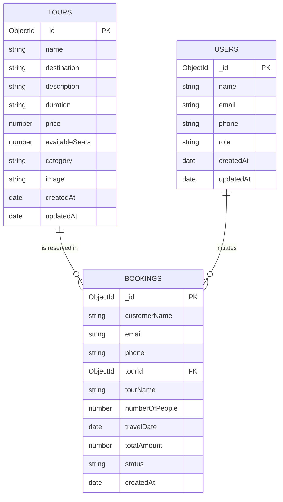

# Database Design & Modeling

## 1. Overview
- **Database Engine**: MongoDB (Document-oriented NoSQL Database)
- **Database Name**: `tour_travel_db`
- **Object Data Modeling (ODM)**: Mongoose
- **Architecture**: Normalized-Referenced Hybrid Document Model

In this system, MongoDB collections are structured to maintain entity independence while preserving referential integrity:
1. `users`: Stores registered customers and administrators.
2. `tours`: Contains available holiday packages, seat inventory, pricing, and category metadata.
3. `bookings`: Records customer reservation transactions, referencing the corresponding `tourId` and snapshotting `tourName` and calculated `totalAmount`.

---

## 2. Entity-Relationship (ER) Diagram



---

## 3. Detailed Collection Schemas

### Collection 1: `users`
Represents users interacting with the application.

| Field | Data Type | Required | Constraints / Default | Description |
|---|---|---|---|---|
| `_id` | ObjectId | Auto | Primary Key | Unique document identifier |
| `name` | String | Yes | Trimmed | User's full name |
| `email` | String | Yes | Trimmed, Lowercase | Primary contact and identity |
| `phone` | String | Yes | Trimmed | Contact mobile number |
| `role` | String | No | Enum: `['customer', 'admin']`, Default: `'customer'` | Access role for administrative functions |
| `createdAt` | Date | Auto | Timestamps option | Document creation timestamp |
| `updatedAt` | Date | Auto | Timestamps option | Document update timestamp |

**JSON Document Example:**
```json
{
  "_id": "664f1092a1e8bc001ef00101",
  "name": "Rahul Sharma",
  "email": "rahul@gmail.com",
  "phone": "9876543210",
  "role": "customer",
  "createdAt": "2026-09-15T10:00:00.000Z",
  "updatedAt": "2026-09-15T10:00:00.000Z"
}
```

---

### Collection 2: `tours`
Represents tour and travel holiday packages available for customer reservation.

| Field | Data Type | Required | Constraints / Default | Description |
|---|---|---|---|---|
| `_id` | ObjectId | Auto | Primary Key | Unique tour identifier |
| `name` | String | Yes | Trimmed | Package title (e.g. "Goa Coastal Beach & Cruise Holiday") |
| `destination` | String | Yes | Trimmed | Geographical location / state |
| `description` | String | Yes | Text | Detailed itinerary and inclusions |
| `duration` | String | Yes | Text | Duration in Days and Nights (e.g. "4 Days / 3 Nights") |
| `price` | Number | Yes | Min: 0 | Package base price per traveler in INR (₹) |
| `availableSeats` | Number | Yes | Min: 0 | Live seat capacity remaining |
| `category` | String | No | Enum: `['Adventure', 'Beach', 'Heritage', 'Honeymoon', 'Nature']`, Default: `'Adventure'` | Package classification |
| `image` | String | Yes | Valid URL | Visual photography banner |
| `createdAt` | Date | Auto | Timestamps option | Date of tour creation |
| `updatedAt` | Date | Auto | Timestamps option | Date of tour modification |

**JSON Document Example:**
```json
{
  "_id": "664f1092a1e8bc001ef00201",
  "name": "Goa Coastal Beach & Cruise Holiday",
  "destination": "Goa, India",
  "description": "Relax on sun-kissed beaches, enjoy water sports at Calangute, and experience sunset river cruises along the Mandovi river.",
  "duration": "4 Days / 3 Nights",
  "price": 12999,
  "availableSeats": 23,
  "category": "Beach",
  "image": "https://images.unsplash.com/photo-1512343879784-a960bf40e7f2?auto=format&fit=crop&w=800&q=80",
  "createdAt": "2026-09-15T10:05:00.000Z",
  "updatedAt": "2026-09-15T10:15:00.000Z"
}
```

---

### Collection 3: `bookings`
Records transactions when a customer books seats for a specific tour.

| Field | Data Type | Required | Constraints / Default | Description |
|---|---|---|---|---|
| `_id` | ObjectId | Auto | Primary Key | Unique reservation reference code |
| `customerName` | String | Yes | Trimmed | Traveler primary booking contact |
| `email` | String | Yes | Trimmed, Lowercase | Confirmation email address |
| `phone` | String | Yes | Trimmed | Contact telephone number |
| `tourId` | ObjectId | Yes | Ref: `'Tour'` | Foreign key reference to `tours._id` |
| `tourName` | String | Yes | Snapshot | Name of tour at the moment of booking |
| `numberOfPeople`| Number | Yes | Min: 1 | Number of travelers reserved |
| `travelDate` | Date | Yes | Valid Date | Scheduled departure date |
| `totalAmount` | Number | Yes | Computed | `price * numberOfPeople` |
| `status` | String | Yes | Enum: `['Pending', 'Confirmed', 'Cancelled']`, Default: `'Confirmed'` | Operational reservation status |
| `createdAt` | Date | Auto | Default: `Date.now` | Booking transaction timestamp |

**JSON Document Example:**
```json
{
  "_id": "664f1092a1e8bc001ef00301",
  "customerName": "Rahul Sharma",
  "email": "rahul@gmail.com",
  "phone": "9876543210",
  "tourId": "664f1092a1e8bc001ef00201",
  "tourName": "Goa Coastal Beach & Cruise Holiday",
  "numberOfPeople": 2,
  "travelDate": "2026-10-15T00:00:00.000Z",
  "totalAmount": 25998,
  "status": "Confirmed",
  "createdAt": "2026-09-15T10:15:00.000Z"
}
```

---

## 4. Integrity Constraints & Business Invariants
1. **Seat Invariant**: `availableSeats >= 0` at all times.
2. **Atomic Seat Decrement**: On booking insertion, `availableSeats = availableSeats - numberOfPeople`.
3. **Seat Cancellation Refund**: When an order transitions `Confirmed/Pending -> Cancelled`, the reserved seats are credited back to the tour: `availableSeats = availableSeats + numberOfPeople`.
4. **Seat Reinstatement Check**: When an order transitions `Cancelled -> Confirmed/Pending`, the system ensures `availableSeats >= numberOfPeople` before re-deducting seats.