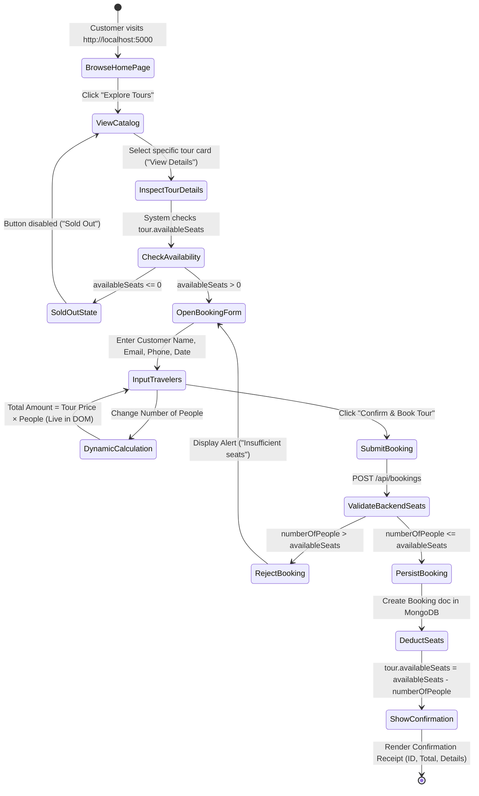
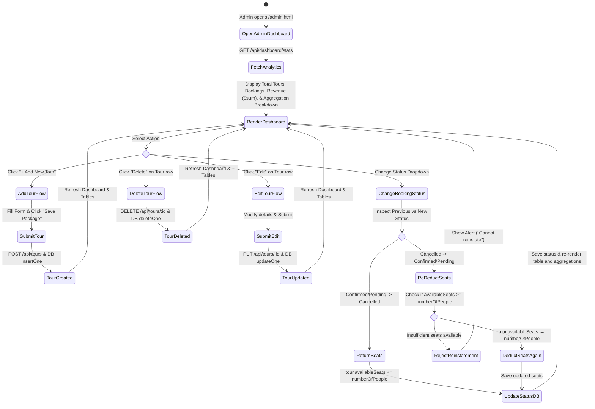

# Software Engineering - Activity Diagrams

This document contains Activity Diagrams detailing the operational workflows of the **Tour & Travel Management System**, reflecting the actual client-server execution paths.

---

## 1. Activity Diagram 1: Customer Tour Booking Workflow

---

## 2. Activity Diagram 2: Admin Tour & Booking Status Management Workflow

